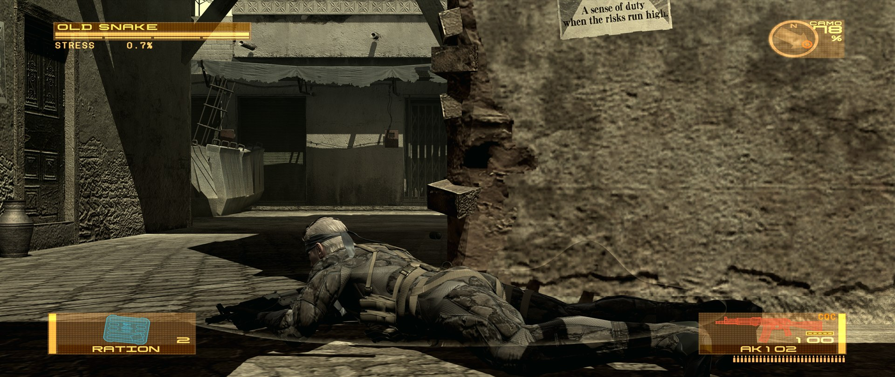
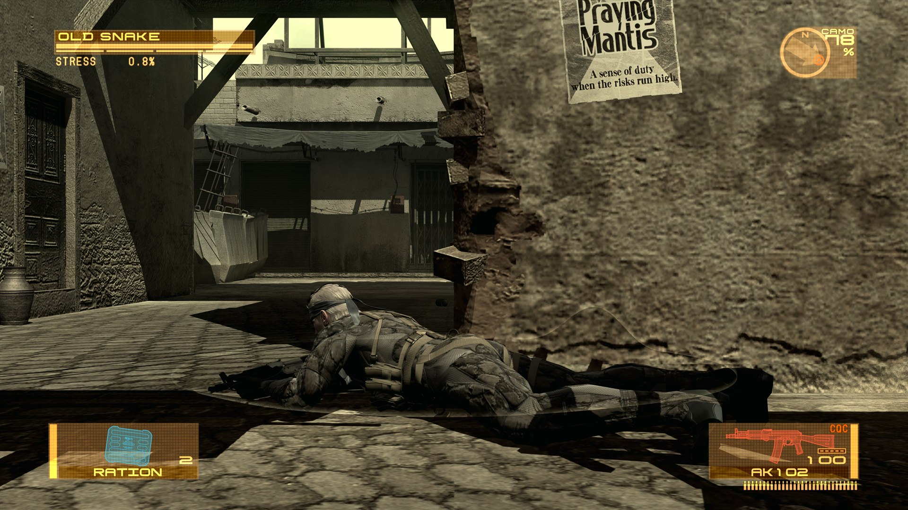
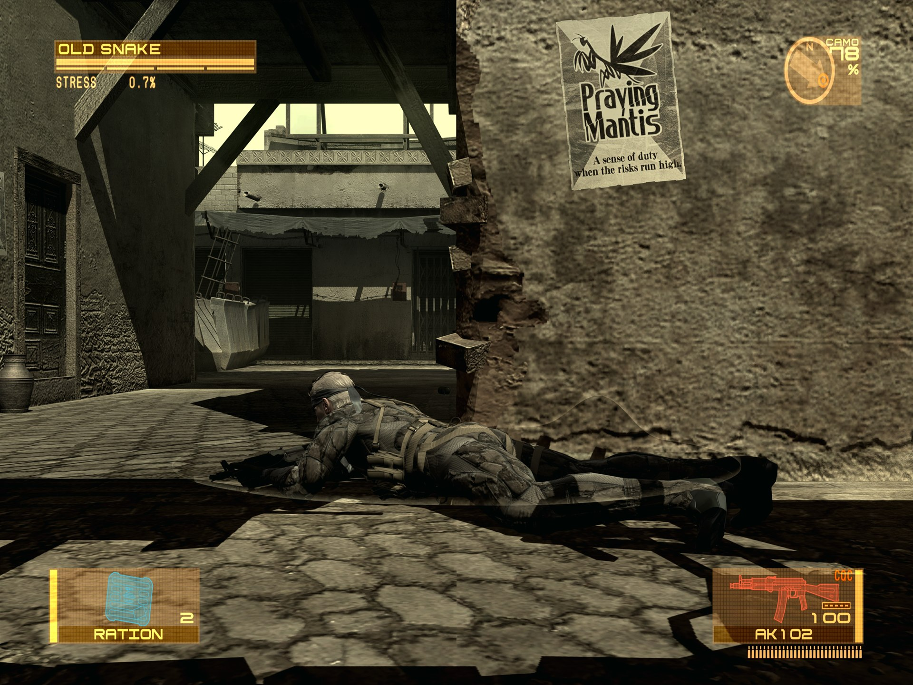
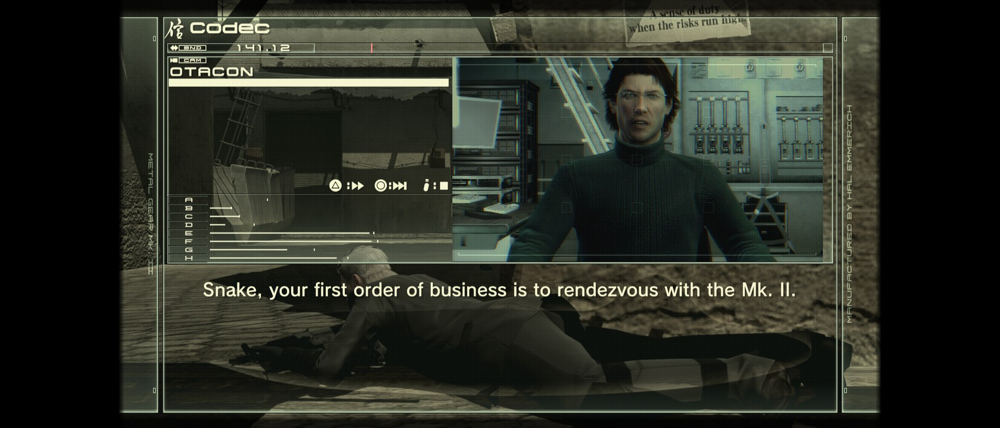
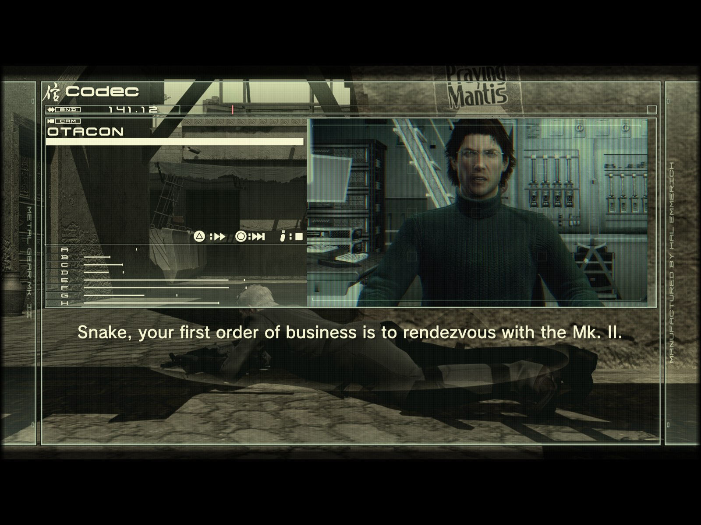
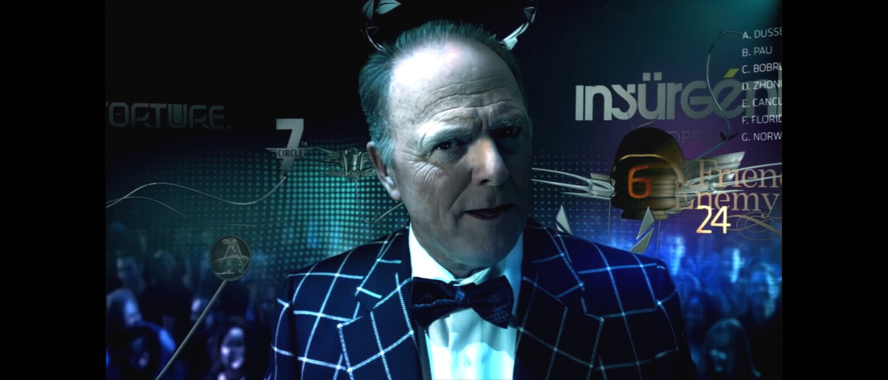
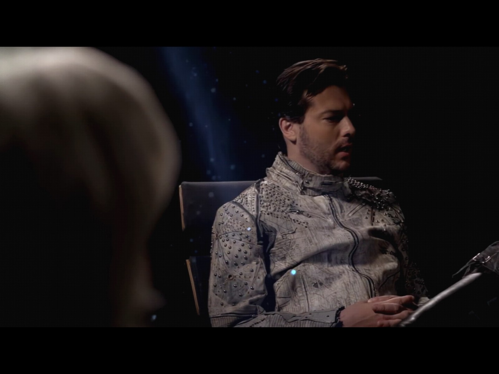
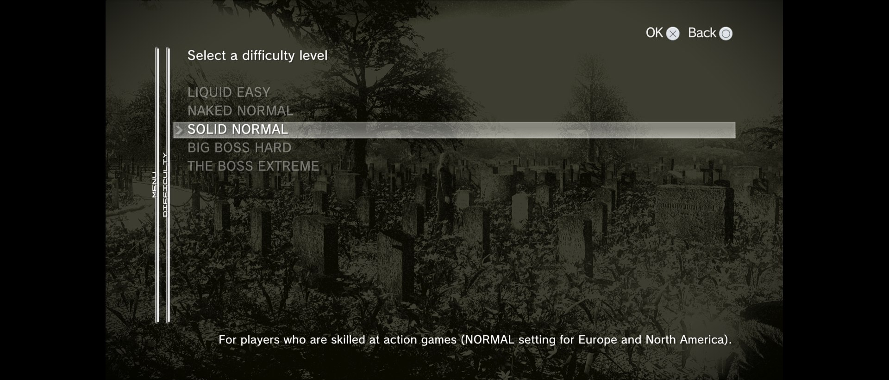

# MGS4 SSAA and Aspect Ratio Enabler

A graphics mod for **METAL GEAR SOLID 4** in the Master Collection on PC. It adds supersampling,
higher resolution shadows, anisotropic filtering and FXAA control, lets you pick the window
resolution and aspect ratio, and fixes the HUD, menus and cutscenes so they look right on
ultrawide (21:9, 32:9) and 4:3 displays instead of being stretched to fit.

It comes as an `.asi` that patches the game in memory as it starts, plus a small settings tool.
No game files are modified.

## The HUD at three aspect ratios

The game draws its entire interface in a 16:9 space and stretches that to whatever the window
is. On a 21:9 monitor everything comes out wide and the compass turns into an oval; on 4:3 it
all gets squashed. With the Expanded HUD setting, every element keeps its proper shape and the
corner widgets sit at the edges of the actual screen, where they belong.

**21:9 (3840x1620), Expanded HUD**



**16:9 (3840x2160)**



**4:3 (2880x2160), Expanded HUD**



Menus, the codec, loading screens and cutscenes are handled too: they are shown as the 16:9
picture they were designed as, centred, with black bars over the rest of the window rather than
the world leaking past their edges. On an ultrawide the cutscene camera is zoomed back out so
the full frame fits, because the engine otherwise keeps the 16:9 width and cuts the top and
bottom off.

## Cutscenes, videos, codec and menus

Three more places the game stretched things that were never meant to stretch. All of them are
fixed in 0.0.3, on DX11 and DX12.

**Codec calls.** The caller's portrait is rendered by its own camera, and that camera took the
window's shape: a narrow face on an ultrawide, a wide one on 4:3. It now keeps the 16:9 framing
inside the codec, and the codec itself sits in the masked 16:9 area like the other menus.

**21:9 (1920x823)**



**4:3 (1600x1200)**



**Pre-rendered videos.** The opening's TV commercials and the other video segments were drawn
over the whole window, so on anything but 16:9 they were stretched, and the masking never
caught them because they are not camera cutscenes. They now play pillarboxed on an ultrawide and
letterboxed on 4:3.

**21:9 (1920x823)**



**4:3 (1600x1200)**



**System menus.** The difficulty select, the load list and the options screen are laid out on a
different canvas from the rest of the interface, and that canvas was scaled independently on each
axis. They stretched across the full window while the main menu next to them did not. They now
follow the same 16:9 layout as everything else.

**21:9 (1920x823)**



The same release also fixes a bigger one that affected every non-16:9 window: the renderer's
final composition pass was drawing the whole picture into a centred 16:9 band of the window, so
a 4:3 or 21:9 picture came out squeezed with uncleared corners, on both DX11 and DX12. That
pass now covers the full window.

## Features

**Aspect ratio and HUD**
- Window resolution and aspect ratio selection (16:9, 21:9, 32:9, 4:3) independent of the
  game's own launcher settings.
- Three HUD modes: Stretched (the game's behaviour), Centered (every widget at its proper shape,
  interface centred in a 16:9 area) and Expanded (same, with the life bar, camo meter, weapon
  and item panels moved out to the real screen edges; wheels and menus stay centred).
- World-pinned labels (pickup names, Solid Eye stat blocks, targeting icons) stay on the
  objects they mark.
- 16:9 masking for menus, codec, loading screens and cutscenes, and a cutscene FOV fix for
  wide windows. Each is its own switch.
- Gameplay FOV adjustment, 50 to 200 percent. Cutscenes are not affected.

**Image quality**
- Internal resolution scaling up to 400 percent (supersampling). The window stays at your
  chosen resolution; the game renders larger and scales down.
- Shadow map resolution scaling and shadow filter sample count.
- Anisotropic filtering up to 16x.
- FXAA on/off and its quality level, which the game never exposes.

**Housekeeping**
- A settings tool that writes one file, `MGS4Enabler.settings`, with the defaults filled in.
- Plays nicely with other mods: where another mod it knows about controls the same thing,
  that mod's setting wins and the tool tells you so.
- Nothing phones home. No updater, no telemetry.

**Planned**
- 16:10 displays: the same HUD, menu and cutscene treatment. The masking and FOV work is
  written against the window's real shape, proper offsets just need to be added for 16:10
  resolutions.

## Installation

Extract the zip into the game's **install folder**, the one that contains the `MGS4` folder
(Steam: right-click the game, Manage, Browse local files):

```
METAL GEAR SOLID 4\
├─ MGS4Enabler.exe
├─ README.md
├─ UltimateASILoader_LICENSE.md
└─ MGS4\
   ├─ winmm.dll                (Ultimate ASI Loader)
   └─ scripts\MGS4Enabler.asi
```

Run **MGS4Enabler.exe** from that folder, pick your settings and save. That creates
`MGS4Enabler.settings` next to it, which the `.asi` reads every time the game starts. Changes
take effect on the next launch.

If another mod already gave you an `MGS4\winmm.dll`, it is the same loader; keep whichever is
newer. The loader runs every `.asi` in `MGS4\scripts`.

Do not put an `.asi` in the game's install folder itself. It is not loaded from there, and
some mods' config tools hang if they find one.

## Settings

Everything is on the **Graphics** tab. Hover a setting in the tool for a longer explanation.

| Setting | Default | What it does |
| --- | --- | --- |
| **Window Aspect Ratio** | Use Game Setting | Overrides the output resolution. Choosing 16:9, 21:9, 32:9 or 4:3 reveals a list of resolutions for that shape. Leave it on Use Game Setting to keep whatever the game's launcher selected. |
| **Ultrawide HUD** | Expanded HUD | How the HUD is laid out on a window that is not 16:9. **Stretched HUD** is the game's own behaviour. **Centered HUD** gives every widget its proper shape and centres the interface in a 16:9 area. **Expanded HUD** does that and moves the life bar, camo meter, weapon and item panels out to the real edges. Works from the actual window size, so it also applies on a native ultrawide or 4:3 display with the aspect left on Use Game Setting. No effect at 16:9. |
| **Solid Eye Overlay Fix** | on | With a Centered or Expanded HUD, keeps the labels that follow things in the world on the objects they mark instead of sliding toward the centre with the rest of the interface. |
| **Menu Masking** | on | Keeps the title screen, main menu, pause menu, codec and loading screens at 16:9 and blacks out the rest of the window. Needs a Centered or Expanded HUD. |
| **Cutscene Masking** | on | Shows cutscenes as the 16:9 picture centred in the window with black bars over the rest. Pair it with Cutscene FOV Compensation on an ultrawide. |
| **Cutscene FOV Compensation** | on | On a window wider than 16:9 the cutscene camera keeps the 16:9 width and crops the top and bottom. This zooms the camera back out so the full frame fits. |
| **FOV Adjustment (%)** | 100 | How much of the world the gameplay camera shows, relative to stock. On a 21:9 window, 133 restores the vertical view you would have at 16:9. |
| **Internal Resolution Scale (%)** | 100 | Renders internally above your display resolution and scales down. Up to 400, with the internal buffer capped at 8192 wide: roughly 400 at 1080p, 200 at 4K. |
| **Shadow Resolution Scale (%)** | 100 | Raises shadow map resolution beyond the game's highest Shadow Quality. 200 doubles it in each dimension and costs four times the shadow memory. |
| **Shadow Softness (Samples)** | 0 (off) | How many samples the game takes filtering a shadow edge. The game's highest preset uses 7. |
| **Anisotropic Filtering** | 0 (off) | Maximum anisotropy for textures seen at a steep angle. The game's highest texture setting asks for 8x; 16x is the hardware maximum and nearly free. |
| **FXAA** | on | Post-process anti-aliasing. Overrides the game's own toggle. Needs a restart either way. |
| **FXAA Quality** | Slow | Slow, Medium or Fast, where slower looks better. The game ships Medium. Worth keeping on even with supersampling, since extra resolution does not fix shader aliasing. |

Notes:

- Internal Resolution Scale is expensive. Every 41 percent adds another whole screen's worth
  of pixels. At a 4K window 200 gives 7680x4320 and anything above that is clamped, which the
  log will tell you.
- Shadow scaling is applied on top of the game's own Shadow Quality option, so leave that at
  its highest.
- A window size that is not your desktop size is scaled to fill the display, keeping its
  shape: 4:3 on a widescreen monitor is pillarboxed, 21:9 on a 16:9 monitor is letterboxed. The
  game on its own paints such a picture unscaled in the top-left corner.
- Works with the game set to either DirectX 11 or DirectX 12 in its options. The game ships
  set to DirectX 11.
- The masking options and FOV Adjustment do nothing at 16:9. They default on because that is
  the framing the game was made for. Turn Cutscene Masking off if you would rather have
  cutscenes fill an ultrawide.
- The aiming reticle stays on screen at any internal resolution. The game truncated a
  coordinate on the way into its UI space, which sent the reticle off screen once the buffer
  was wider than 4095 pixels; the `.asi` widens those conversions. Verified at 8192x4608. The
  cause was found by **drbermejor**'s [mgs4Ultra120](https://github.com/drbermejor/mgs4Ultra120);
  details in [docs/mgs4-rendering-research.md](docs/mgs4-rendering-research.md).

## Mod compatibility

This mod is meant to share the game with others. Where another mod it recognises changes the
same thing as one of these settings, **that mod's setting is used**: the tool greys the field
out and shows the other mod's value, and the `.asi` logs the same. The other mod's files are
only ever read, never written.

Recognised today:

| Mod | Setting here | Stands aside when the other mod... |
| --- | --- | --- |
| MGSPatriotFix | Anisotropic Filtering | is installed at all |
| MGSPatriotFix | Shadow Resolution Scale (%) | has `Custom Shadow Resolution` set to anything but 0 |

More will be added as they come up. The list lives in one table (`shared/compat_table.hpp`)
that both the `.asi` and the tool read.

Some mods have a small config file and no tool of their own. When one of those is installed,
the tool grows a tab for it, and only then:

| Mod | File | What the tab edits |
| --- | --- | --- |
| [MGSFPSUnlock](https://github.com/cipherxof/MGSFPSUnlock) (cipherxof) | `MGSFPSUnlock.ini` | Target frame rate |

A save writes just those values back into the mod's file; comments and everything else in it
stay as they were. If the mod's files are sitting somewhere the game does not load from (the
install folder's own `scripts\` rather than `MGS4\scripts\`, a common slip), the tab says so.

If you used an earlier build of these fixes that shipped inside another mod, the tool's first
run imports your graphics settings from that mod's settings file. Do this before running that
mod's own config tool, if it has one, since those tend to rewrite their file with only the
keys they know.

## Reporting a problem

A report is only useful with a log:

1. In the tool, **Troubleshooting** tab, tick **Debug Logging** and save.
2. Launch the game from Steam and reproduce the problem. If it crashes or hangs, stop there.
3. Quit the game (Task Manager if it hung).
4. Attach `logs\MGS4Enabler_Game.log` from the game's install folder. The log is rewritten
   on every launch, so copy it before starting the game again.

**A HUD element in the wrong place on an ultrawide or 4:3 screen:** with Debug Logging on and
a Centered or Expanded HUD, press **F11** in-game while the element is on screen. A record of
every HUD element being drawn at that moment goes into the log. Take a screenshot at the same
moment (Steam's F12) and attach both.

Issues: <https://github.com/BevelTipDrip/MGS4-SSAA-AspectRatio-Enabler/issues>

## Building

Visual Studio 2026 Build Tools (v145, C++20), Windows SDK 10. Clone with submodules, then
`build\build.cmd` builds Zydis and wxWidgets once and the solution after that; output lands in
`bin\Release`. `build\package.ps1` makes the release zip. It needs the
[Ultimate ASI Loader](https://github.com/ThirteenAG/Ultimate-ASI-Loader/releases) zip, which
is not in the repository.

The ultrawide and 4:3 layout code is a private submodule (`external/ultrawide`). Without it
the project still builds, with a stub in its place: every setting works except the Ultrawide
HUD family, which then does nothing. That component has its own licence (see below).

Two configurations: **Release** is what ships. **Lab** (`build\build.cmd lab`, output in
`bin\Lab`) compiles in the research instrumentation and the lab settings file that the test
harness drives. A Release build contains none of it.

## Credits

ASI loading by [Ultimate ASI Loader](https://github.com/ThirteenAG/Ultimate-ASI-Loader)
(ThirteenAG), see `UltimateASILoader_LICENSE.md`.

Libraries: [safetyhook](https://github.com/cursey/safetyhook) (hooking),
[Zydis](https://github.com/zyantific/zydis) (instruction decoding),
[spdlog](https://github.com/gabime/spdlog) (logging), [wxWidgets](https://www.wxwidgets.org/)
(the tool).

## Licence

This repository is under the MIT License, see `LICENSE.md`.

The ultrawide and 4:3 fix (the private `external/ultrawide` submodule, compiled into the
release binaries) is licensed separately, under a credit-required licence: you may use, modify
and redistribute it, in your own mods too, but the fix must be credited wherever it is used or distributed. That means the mod page, the README with a link to this repository. Passing it off as your own ends that
permission. The full text is in the submodule's `LICENSE.md`.
